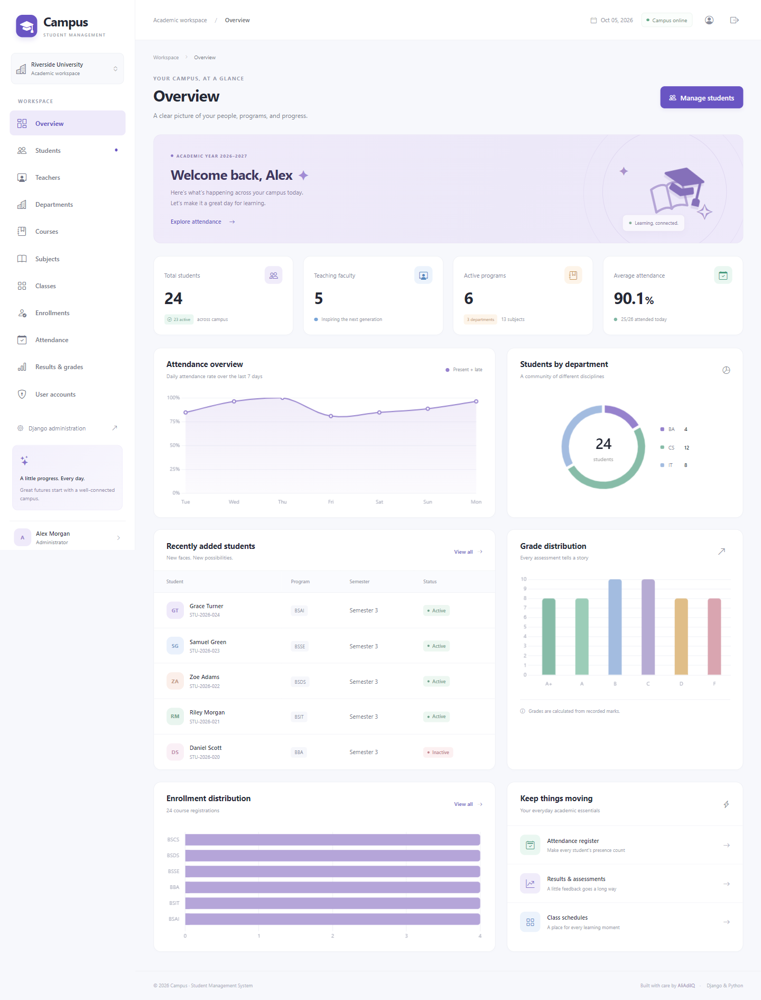
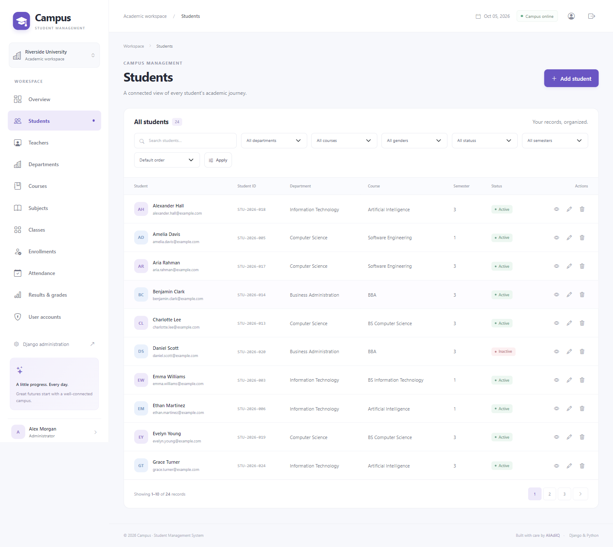
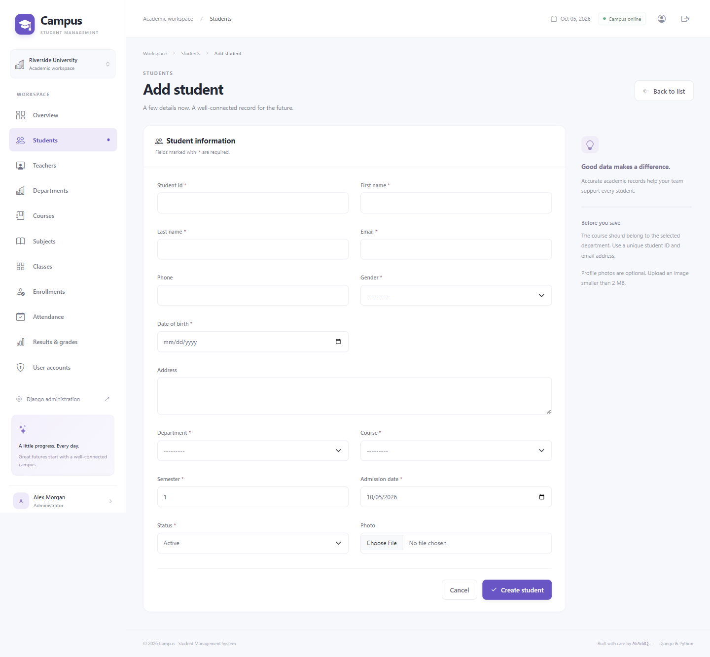
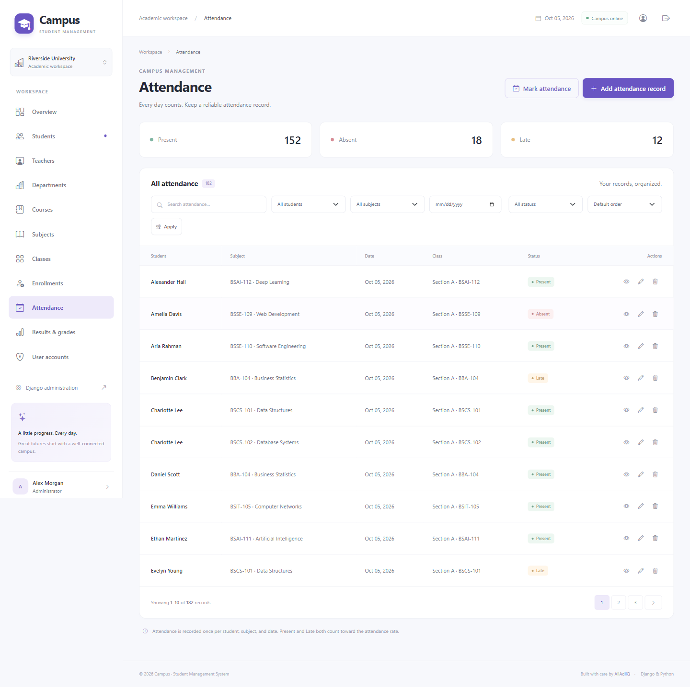
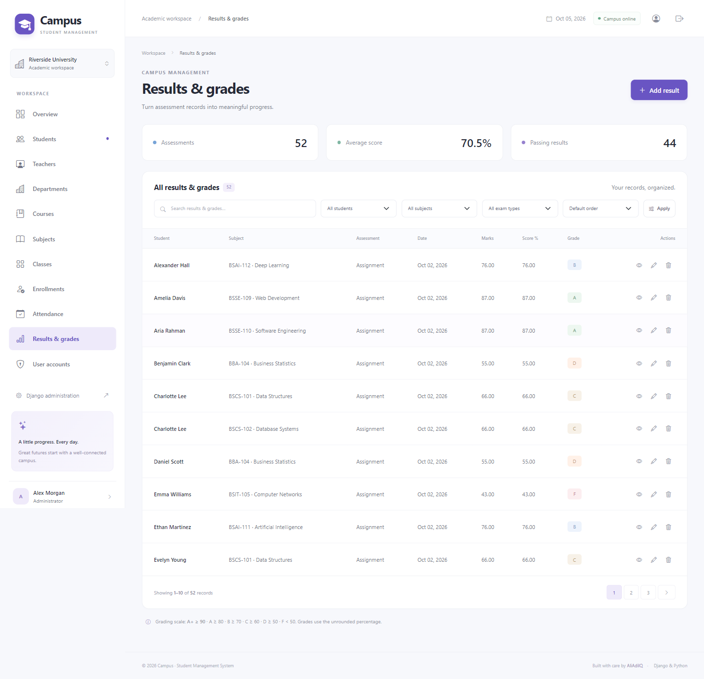
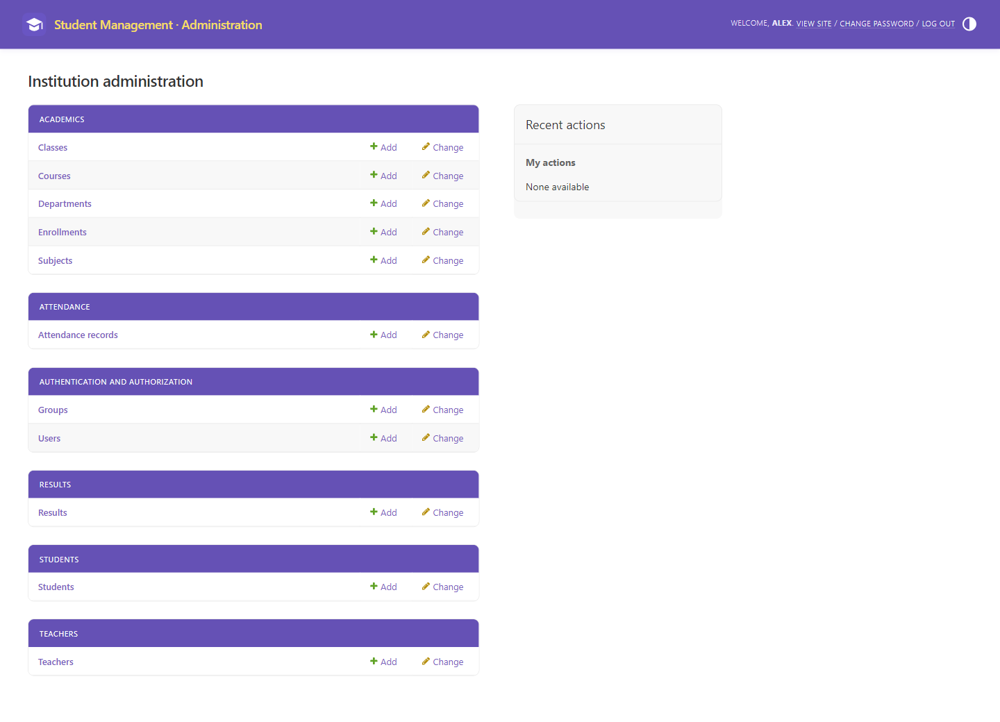

# Student Management System

[](https://github.com/AliAdilQ/student_management_system/actions/workflows/django.yml)


[](LICENSE)

A complete academic administration workspace built with Python and Django. **Campus** brings students, faculty, curriculum, attendance, and assessment records into one responsive interface, backed by a configurable Django admin panel.



## Project Overview

Built for **Riverside University**, a fictional institution, this portfolio project demonstrates relational data modeling, permission-based workflows, validated forms, repeatable demo data, and a cohesive server-rendered interface. It runs locally with SQLite and requires no frontend build step or external account.

The repository is prepared for [AliAdilQ/student_management_system](https://github.com/AliAdilQ/student_management_system). All sample identities and academic records are fictional.

## Features

- **Academic dashboard:** student and faculty totals, departments, courses, subjects, today's attendance, average attendance, and recent students.
- **Four interactive charts:** seven-day attendance, students by department, grade distribution, and course enrollments.
- **Complete CRUD:** students, teachers, departments, courses, subjects, classes, enrollments, attendance records, results, and user accounts.
- **Student profiles:** contact and academic information, optional photos, attendance rate, enrollments, and assessment history.
- **Search, filters, sorting, and pagination:** module-specific search and validated filters with ten records per page.
- **Daily attendance register:** load a roster by subject/date/class, mark Present/Absent/Late, and safely update existing entries.
- **Automatic grading:** precise percentages and grades based on marks; validation rejects negative marks, zero totals, and scores above the total.
- **Secure account workflows:** Django authentication, POST logout, CSRF protection, password change, and three permission groups.
- **Django admin:** searchable, filtered model lists with useful fieldsets and computed grades.
- **Polished UI:** responsive sidebar, breadcrumbs, avatar placeholders, badges, alerts, confirmation pages, empty states, and consistent error pages.
- **GitHub preparation:** MIT license, environment example, migrations, tests, CI workflow, actual screenshots, and bundled frontend libraries.

## Screenshots

These images are captured from the running application using the seeded demo database.

### Dashboard


### Student Management



### Add/Edit Student



### Attendance Management



### Results Management



### Django Admin Panel



An additional [mobile dashboard screenshot](screenshots/mobile_dashboard.png) demonstrates the responsive layout.

## Technologies Used

| Technology | Purpose |
| --- | --- |
| Python 3.10+ | Application runtime; locally verified with Python 3.12 |
| Django 5.2.17 LTS | Authentication, ORM, forms, views, templates, admin, and tests |
| SQLite | Local development database |
| HTML5, CSS3, JavaScript | Server-rendered responsive interface |
| Bootstrap 5.3.3 | Grid, form controls, and reusable UI behavior |
| Bootstrap Icons 1.11.3 | Locally bundled icon fonts |
| Chart.js 4.4.8 | Dashboard charts |
| Pillow 12.3.0 | Image upload validation |
| python-dotenv 1.2.4 | Local `.env` configuration |

Frontend libraries and their upstream MIT licenses are included in `static/vendor/`; no CDN is required to use the application. README badge images require internet access. There is no React or separate frontend framework.

## Project Structure

```text
student_management_system/
├── manage.py
├── requirements.txt
├── README.md
├── LICENSE
├── .gitignore
├── .env.example
├── .github/workflows/django.yml
├── student_management_system/     # Settings, URL routing, WSGI, ASGI
├── core/                          # Dashboard, auth, shared CRUD, roles, seed command
│   └── management/commands/seed_data.py
├── students/                      # Student profiles and validation
├── teachers/                      # Faculty and optional account links
├── academics/                     # Departments, courses, subjects, classes, enrollments
├── attendance/                    # Daily records and attendance register
├── results/                       # Assessment records and calculated grades
├── templates/
│   ├── base.html
│   ├── partials/                  # Sidebar, navbar, footer, messages, forms, pagination
│   ├── core/
│   ├── attendance/
│   ├── registration/
│   └── errors/                    # Shared visual design for 403/404/500
├── static/
│   ├── css/app.css
│   ├── js/
│   ├── images/
│   └── vendor/
├── media/                         # Ignored uploads; directory tracked with .gitkeep
├── screenshots/                   # Real application screenshots
└── tools/verify_browser.cjs        # Optional browser verification and capture
```

Every model app includes committed migrations, admin configuration, and tests. Common CRUD behavior lives in `core/registry.py` and `core/views.py` so search, forms, permissions, and templates stay consistent.

## Installation

Install **Python 3.10 or newer** and Git. Python 3.8 is not compatible with these dependencies.

```bash
git clone https://github.com/AliAdilQ/student_management_system.git
cd student_management_system
python -m venv venv
```

Activate the environment on **Windows**:

```powershell
venv\Scripts\Activate.ps1
```

For Windows Command Prompt:

```bat
venv\Scripts\activate.bat
```

Activate the environment on **Linux/macOS**:

```bash
source venv/bin/activate
```

Install the application dependencies:

```bash
python -m pip install -r requirements.txt
```

## Configuration

The application loads `.env` from the project root and also supports operating-system environment variables (which take precedence). `.env` is ignored by Git.

Copy the example on Windows PowerShell:

```powershell
Copy-Item .env.example .env
```

Or on Linux/macOS:

```bash
cp .env.example .env
```

Generate a unique key and put it in `.env` as `SECRET_KEY`:

```bash
python -c "from django.core.management.utils import get_random_secret_key; print(get_random_secret_key())"
```

For convenience, when running locally without any configured secret, the first Django command creates an ignored `.env` with a random key. An existing `.env` with other settings is preserved. Production requires an explicitly configured key of at least 50 characters.

| Variable | Local default | Meaning |
| --- | --- | --- |
| `SECRET_KEY` | Generated locally if missing | Unique signing secret; never commit it |
| `DEBUG` | `True` | Local development mode |
| `ALLOWED_HOSTS` | `127.0.0.1,localhost` | Comma-separated permitted hostnames |
| `TIME_ZONE` | `Asia/Jakarta` | Dates used for attendance and dashboard statistics |
| `SECURE_SSL_REDIRECT` | `False` in development, `True` in production | Redirect HTTP requests to HTTPS |
| `SECURE_HSTS_SECONDS` | `0` in development, `31536000` in production | HTTPS strict transport policy |

The example sets local HTTP options explicitly. Set the production values before deployment; never reuse the example secret.

## Database Setup

Apply the committed migrations:

```bash
python manage.py migrate
python manage.py check
```

SQLite creates `db.sqlite3` locally. The database is intentionally ignored by Git; demo data is reproducible through the seed command.

Relationships include Department → Course → Subject, Teacher → Subject, Student → Department/Course, and Student → Enrollment/Attendance/Result. Enrollment subjects use a many-to-many relationship, and faculty login links use a one-to-one relationship.

Important parent records use protective deletion. Deleting a student cascades to their enrollment, attendance, and result records after an explicit confirmation. Model/form validation enforces coherent courses, semesters, dates, and marks; database constraints prevent duplicate registrations, duplicate daily attendance, and invalid result marks. Direct ORM scripts should call `full_clean()` before saving when model validation is needed, as Django's `save()` does not automatically run it.

## Dummy Data Setup

```bash
python manage.py seed_data
```

The deterministic, transactional seed command creates:

- 24 students with multiple genders, semesters, and active/inactive statuses.
- 5 teachers and 3 departments: Computer Science, Business Administration, and Information Technology.
- 6 courses: BS Computer Science, BBA, BS Information Technology, Data Science, Software Engineering, and Artificial Intelligence.
- 13 subjects and 13 class sections with rooms and schedules.
- Course enrollments with selected semester subjects.
- Seven days of attendance and two assessments per relevant subject, including varied letter grades.
- Registrar, Faculty, and Viewer permission groups.
- A demo superuser if the username `admin` does not already exist.

Rerunning on the same date keeps record counts stable and preserves existing records and passwords. On later dates, the rolling demo attendance/assessment history can add new records; it does not erase your data. Permission groups are synchronized to the documented demo roles when seeding. Demo seeding refuses to run with `DEBUG=False`.

## Demo Admin Credentials

| Field | Value |
| --- | --- |
| Username | `admin` |
| Password | `Admin@12345` |
| Email | `admin@example.com` |

**These credentials are for local testing only.** Change the password before sharing a running instance. Do not seed a real deployment. The credentials appear only in the demo command and documentation, not in production settings. Existing accounts named `admin` retain their passwords and privileges; the seed command does not promote them.

For a real administrator account:

```bash
python manage.py createsuperuser
```

## Usage

```bash
python manage.py runserver
```

Open [http://127.0.0.1:8000/](http://127.0.0.1:8000/) and sign in. Django administration is available at [http://127.0.0.1:8000/admin/](http://127.0.0.1:8000/admin/).

1. Start with the dashboard to review campus statistics and trends.
2. Use **Students** to search, add, edit, and open complete student profiles.
3. Configure departments, courses, subjects, teachers, and class schedules.
4. Create course enrollments and optionally select subjects from that course/semester.
5. Open **Attendance → Mark attendance**, select a subject and date, load the roster, and save Present/Absent/Late for each active student in that course. Existing entries load for updates.
6. Add assessments under **Results & grades**. Percentages and grades are calculated automatically.
7. As a superuser, open **User accounts** to create accounts and assign roles. Use Django administration to grant custom permissions, staff access, or superuser status.
8. Open your profile to change your password. Logout uses a CSRF-protected POST request.

### Roles

| Role | Read academic modules | Manage academic data | Manage accounts | Django admin |
| --- | --- | --- | --- | --- |
| Superuser | Yes | All modules | Yes | Yes |
| Registrar | Yes | All academic modules | No | Only if separately marked staff |
| Faculty | Yes | Add/edit attendance and results | No | Only if separately marked staff |
| Viewer | Yes | No | No | Only if separately marked staff |

All active authenticated users can read the academic workspace, including student contact details. This is an internal staff application, not a student self-service portal. Faculty permissions apply to all attendance/results in the workspace; linking a teacher account does not restrict it to their subjects. Only administrators should provision access. Custom model permissions can be assigned in Django admin; `is_staff` alone does not grant write permissions.

### Validation and grading

Grades use the unrounded percentage; the displayed percentage rounds to two decimal places.

| Grade | Percentage |
| --- | --- |
| A+ | 90–100 |
| A | 80–<90 |
| B | 70–<80 |
| C | 60–<70 |
| D | 50–<60 |
| F | <50 |

Attendance rates include **Present + Late** divided by all recorded attendance. Dashboard averages count attendance records, not distinct students; today's count is also per subject/student record. With no records, the rate displays 0%. Editing a student's course or a linked subject's course/semester is blocked until their connected academic records are removed or reassigned.

### Verification

```bash
python manage.py check
python manage.py makemigrations --check --dry-run
python manage.py test
```

Tests cover authentication protection, role restrictions, CSRF, CRUD, student search/pagination, attendance constraints and bulk marking, grade boundaries, enrollment validation, protective deletion, password changes, and seed idempotency. GitHub Actions runs the suite on Python 3.10, 3.12, and 3.13.

For optional real-browser checks and fresh screenshots, install Node.js and Playwright separately (neither is required to run the application):

```bash
npm install --no-save --package-lock=false playwright
npx playwright install chromium
node tools/verify_browser.cjs
```

Run the Django server and seed the database first. The script uses the documented demo credentials, checks every module, performs student CRUD with a temporary test record, verifies charts/admin/mobile layouts, and refreshes the screenshots. Optional variables: `TEST_BASE_URL` and `TEST_BROWSER_EXECUTABLE` for an already installed Chromium executable. If you changed the demo password, restore a disposable demo database before running this script. It is intended only for local demo environments.

## Available Modules

| Module | URL | What it manages |
| --- | --- | --- |
| Overview | `/` | Statistics, four charts, and recent students |
| Students | `/students/` | Identity, contact information, academic details, photos, and histories |
| Teachers | `/teachers/` | Faculty details, specialization, and optional login links |
| Departments | `/departments/` | Academic organizational units |
| Courses | `/courses/` | Degree programs and duration |
| Subjects | `/subjects/` | Curriculum, credits, semester, and instructor |
| Classes | `/classes/` | Subject sections, rooms, schedules, and capacity |
| Enrollments | `/enrollments/` | Course/subject registrations and academic years |
| Attendance | `/attendance/` | Searchable daily attendance history |
| Daily register | `/attendance/register/` | Batch attendance entry and updates |
| Results & grades | `/results/` | Assessment marks, percentage, grade, and feedback |
| User accounts | `/accounts/` | Superuser-only account and role management |
| Your account | `/profile/` | Current account details and password change |
| Django administration | `/admin/` | Built-in model and permission administration |

CRUD modules follow `/<module>/add/`, `/<module>/<id>/`, `/<module>/<id>/edit/`, and `/<module>/<id>/delete/`.

## Security Notes

- Django authentication hashes passwords and uses its standard password validators. Login errors do not reveal whether a username exists.
- All management pages require authentication; mutations check model permissions server-side, independent of button visibility. User management requires a superuser.
- Forms and logout require CSRF tokens, templates escape user content, charts receive data through `json_script`, and ORM queries avoid raw SQL.
- Uploaded images are validated by Pillow and limited to 2 MB. In local development, media is served through an authenticated route. A production deployment must provide an authenticated media-serving/storage solution; development media serving is deliberately disabled when `DEBUG=False`.
- `.env`, uploaded files, virtual environments, and SQLite databases are excluded from Git. No production credentials belong in source control.
- Production requires `DEBUG=False`, a unique signing secret, explicit allowed hosts, HTTPS, secure cookies, and an appropriately configured reverse proxy. HTTPS cookies and HSTS defaults activate outside development.
- Run `python manage.py check --deploy` against your deployment configuration. See the [Django deployment checklist](https://docs.djangoproject.com/en/5.2/howto/deployment/checklist/).
- Use a production WSGI/ASGI server, serve collected static assets, configure backups/logging, apply dependency security updates, and add login rate limiting at the server or application layer before exposing the system publicly. `runserver` is for development.
- The account interface prevents deleting your own user or disabling/deleting the last active superuser. Django admin remains a powerful trusted administration tool.
- Custom 404/500 pages appear with debug disabled; the custom permission-denied page is also available in development.

Collect static assets for deployment with:

```bash
python manage.py collectstatic --noinput
```

## Future Improvements

- Student and parent self-service portals with record-level access controls.
- Faculty ownership restrictions for attendance and grading.
- Timetable conflict detection, capacity enforcement, and classroom enrollment.
- CSV imports/exports, downloadable report cards, and notification workflows.
- Audit history, multifactor authentication, and application-level login throttling.
- PostgreSQL deployment, private object storage, and institutional integrations.

These are optional extensions; the documented local management workflows are implemented.

## Contributing

1. Fork the repository and create a descriptive feature branch.
2. Set up the local environment and run the tests.
3. Keep changes focused, use Django's forms/ORM/permissions, and update documentation if behavior changes.
4. Commit migrations for model changes and add tests for meaningful new behavior.
5. Submit a pull request with the problem, implementation, and validation results.

Report reproducible bugs through [GitHub Issues](https://github.com/AliAdilQ/student_management_system/issues). Never include real student records or secrets in reports.

## License

Released under the [MIT License](LICENSE).

Copyright (c) 2026 AliAdilQ. Bundled third-party libraries retain their upstream licenses in `static/vendor/`.

## Author

**AliAdilQ**

- GitHub: [https://github.com/AliAdilQ](https://github.com/AliAdilQ)
- Repository: [https://github.com/AliAdilQ/student_management_system](https://github.com/AliAdilQ/student_management_system)
